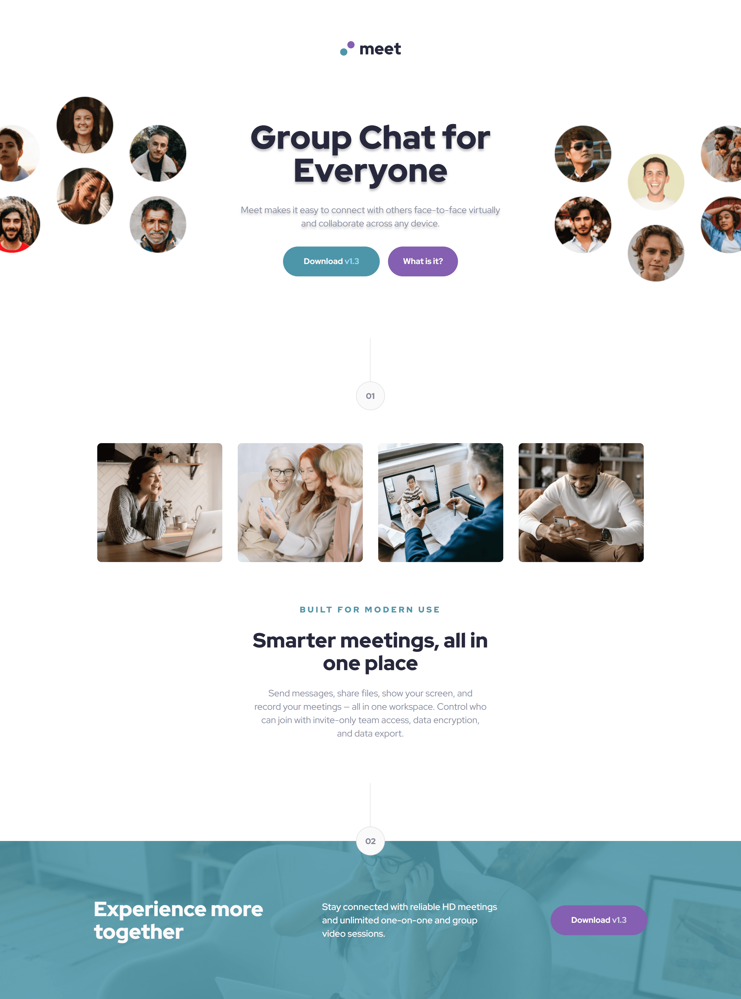

# Frontend Mentor - Meet landing page solution

This is a solution to the [Meet landing page challenge on Frontend Mentor](https://www.frontendmentor.io/challenges/meet-landing-page-rbTDS6OUR). Frontend Mentor challenges help you improve your coding skills by building realistic projects.

## Table of contents

- [Overview](#overview)
  - [The challenge](#the-challenge)
  - [Screenshot](#screenshot)
  - [Links](#links)
- [My process](#my-process)
  - [Built with](#built-with)
  - [What I learned](#what-i-learned)
- [Author](#author)

## Overview

### The challenge

Users should be able to:

- View the optimal layout depending on their device's screen size
- See hover states for interactive elements

### Screenshot

### Links

[Solution URL](https://github.com/Antonvasilache/meet-landing-page)  
[Live Site URL](https://meet-landing-page-av.netlify.app/)

## My process

1. Creating the HTML structure in line with the figma file.
2. Adding the css classes.
3. Creating the layout with approximate spacing.
4. Formatting every section to match the values in figma.
5. Adding fonts and colors.
6. Creating the buttons.
7. Creating media queries and changing the layout and spacing for tablet and mobile.

### Built with

- Semantic HTML5 markup
- CSS custom properties
- Flexbox
- CSS Grid

### What I learned

- Working with figma files.
- Leveraging the power of grid and flexbox in different contexts.
- Using various standard methods of spacing and centering elements.
- Not over relying on fixed values, as it negatively impacts responsiveness.

## Author

- Website - [Antonvasilache.com](https://www.antonvasilache.com)
- Frontend Mentor - [@Antonvasilache](https://www.frontendmentor.io/profile/Antonvasilache)
